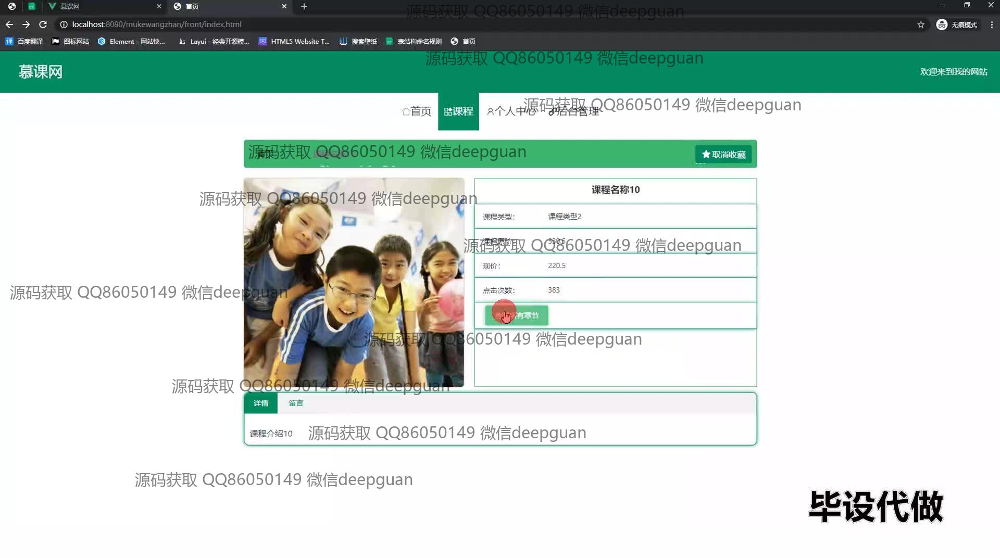

<h1 align="center">基于SSM的高并发慕课网的设计与实现+vue</h1>

## 简介
慕课网管理系统：角色分为管理员、校长、班主任、老师、学生；支持用户信息管理、课程管理、订单管理、高并发抢购、信息编辑及登录注册等功能。    --计算机毕业设计源码；毕设源码；java毕业设计源码

## 联系方式

<h3 align="center">获取完整代码与数据库文件 + 微信：deepguan QQ: 86050149 QQ群: 783742310</h3>

<h3 align="center">可帮忙远程部署 包运行成功！提供远程部署、修改代码、设计文档指导、代码讲解等服务！</h3>

## 功能介绍（完整见运行截图）
管理员：登录界面提供角色选择支持，进入后台管理模块后可进行订单管理，包括查看订单编号、课程信息及支付类型等，并可管理课程及学生信息。 管理员可以查看及编辑用户账户信息、学生姓名、联系方式等基本信息，并进行系统设置和维护，确保系统在高并发情况下的稳定与安全。

学生：可以通过用户界面登录系统，查看个人中心以编辑和更新个人信息。学生可以浏览并查看各类课程信息，包括原价、折扣价及点击次数；支持收藏及购买课程功能，参与高并发场景下的课程抢购，使得浏览和购买体验流畅。学生还能查询和管理自己的订单。

老师：拥有专属登录界面，便捷的个人中心允许管理并更新个人信息。老师可访问课程管理模块，查看和管理与自己相关的课程订单，并通过系统提供的功能优化课程展示和内容，在高并发情况下保证教学资源的合理分配。

校长：在登录后可通过系统查看整体运行状态，并进行教育管理模块的决策支持。校长有权限访问各类统计数据和报表，利用这些信息协调各角色之间的功能运作，确保慕课网的高效与稳定运行，在必要时进行资源优化及调整。

## 运行截图

本代码来源于网络,仅供学习参考使用!

